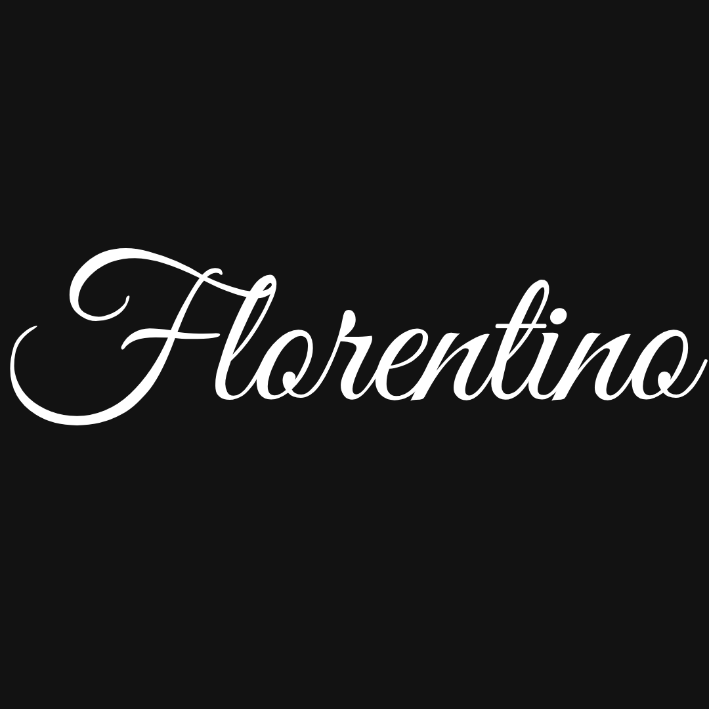

<!DOCTYPE html>
<html lang="pt">
<head>
    <meta charset="UTF-8">
    <meta name="viewport" content="width=device-width, initial-scale=1.0">
    <title>Dashboard - Minha Empresa de Bolos</title>
    
</head>
<body>
    
    

        <a href="Gastos CO-GPT 3.0.html" class="card">Controle Financeiro</a>
        <a href="Inventario.html" class="card">Inventário de Produtos</a>
        <a href="Nota.html" class="card">Notas de Entrega</a>
    

</body>
</html>
